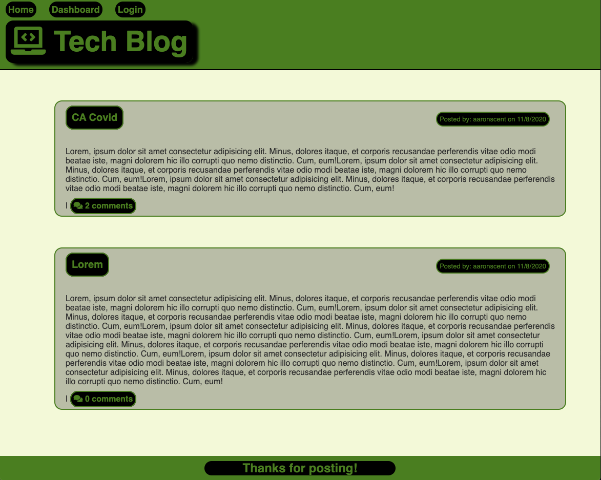
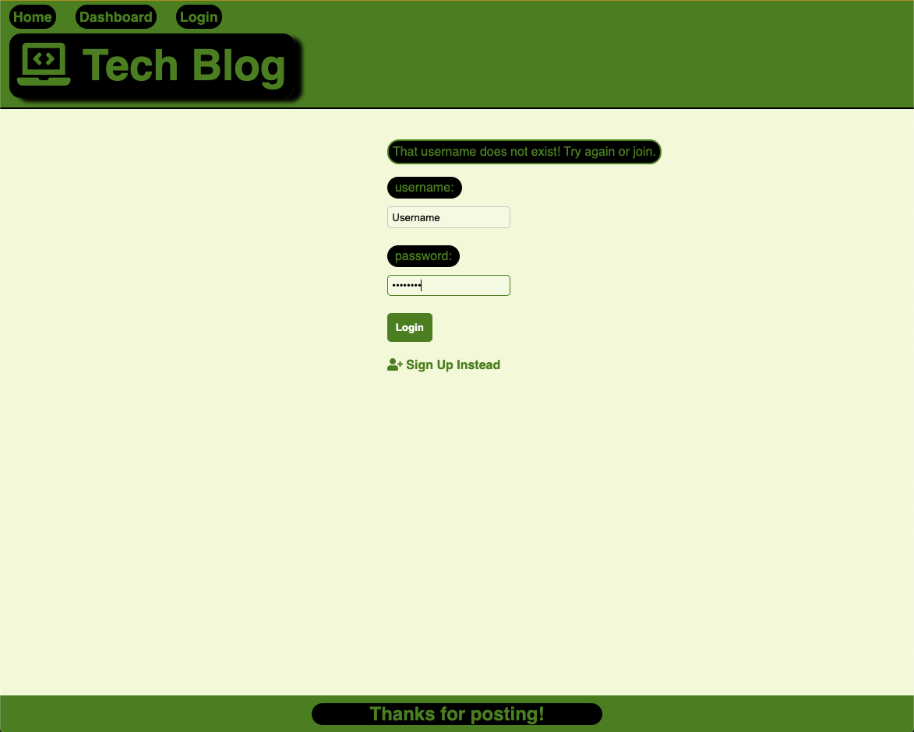
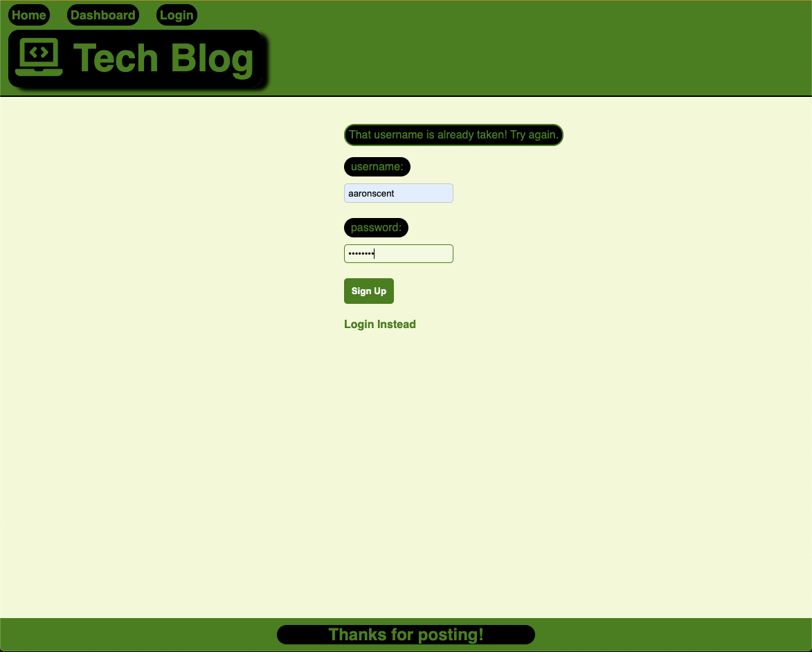
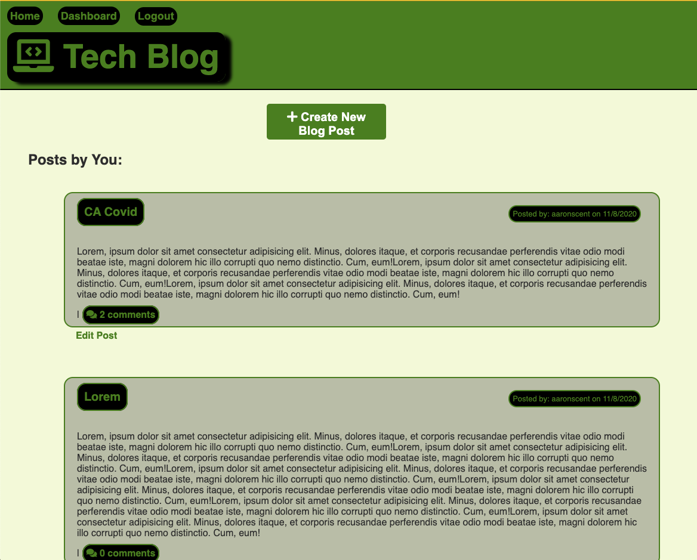
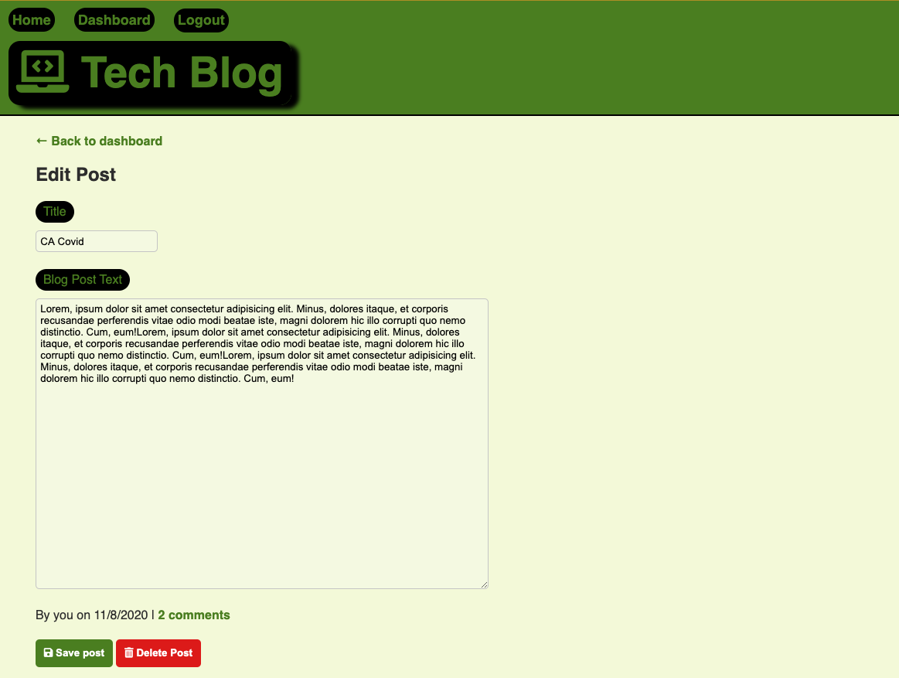

# tech-blog

## Description

The Project of the week was to create a fullstack application from scratch using MVC model. The application is meant to be a tech-blog where users can go to post about whatever they want in the tech industry. Users are able to login if they already have an account. If they do not have an account they are able to sign up for the website. Usernames are required to be uniqe and users will be notified if the username is taken. If the user tries to login but does not have an account they will also be notified. Once logged in users gain more access to certain aspects of the website, such as, creating posts, editing posts, leaving comments and access to their dashboard. 

## Table of Contents

* [Installation](#installation)
* [Usage](#usage)
* [License](#license)
* [Contributing](#contributing)
* [Links](#links)
* [Questions](#questions)

## Installation 

Run 'npm install' in the command line to install all the necessary dependencies if trying to run the app locally.

## Usage

To access this website navigat to https://agile-waters-31192.herokuapp.com/ and create an account. Then begin writing posts, reading posts and leaving comments!

## Licenses

* MIT

## Contributing

* Aaron Centeno

## Technologies Used
* Express
* Node Modules
* GitHub
* JavaScript
* Terminal
* MySQL
* Sequelize
* Handlebars
* Bcrypt

## Screenshots

## Links

Live Application: https://agile-waters-31192.herokuapp.com/

GitHub Repo: https://github.com/aaroncenteno/tech-blog

## Questions

Contact Information for questions: 

GitHub: [aaroncenteno](https://www.github.com/aaroncenteno) 

E-mail: asamcent@gmail.com